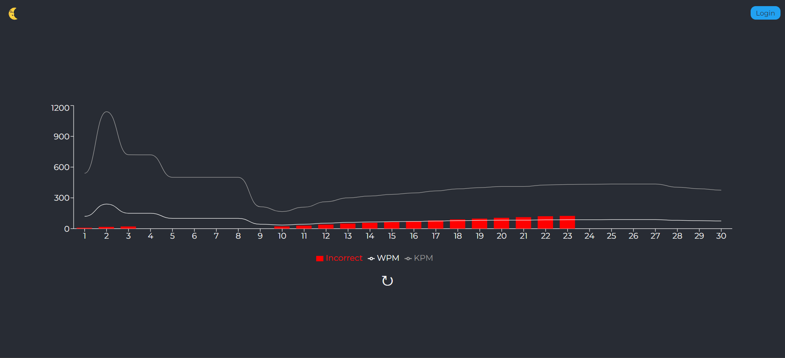

# CodeTyper Pro

CodeTyper Pro is a web application designed to help users improve their typing speed and accuracy through various typing tests. The application tracks user progress, provides stats visualization, and includes user authentication. This project is built with React and Node.js, and stores data in MongoDB.

## Table of Contents

- [Project Overview](#project-overview)
- [Features](#features)
- [Screenshots](#screenshots)
- [Technologies and Libraries](#technologies-and-libraries)
- [Setup and Installation](#setup-and-installation)
- [Usage](#usage)
- [Contributing](#contributing)
- [License](#license)

## Project Overview

CodeTyper Pro offers a platform for users to practice typing in multiple modes, view detailed statistics, and track their progress over time. The project includes the following main components:
1. **Typing Test Module:** Users can choose from different typing modes (e.g., word mode, sentence mode).
2. **Progress Tracking Module:** Stats, such as Words Per Minute (WPM) and Keystrokes Per Minute (KPM), are calculated and visualized on the progress page.
3. **User Authentication:** Registration and login functionality ensures secure access to each user’s data.

## Features

- User Registration and Login
- Typing Test with Multiple Modes
- Progress Visualization with Charts
- Light and Dark Theme Toggle
- Background Music Player for an engaging experience

## Screenshots

  
*Home Page with Typing Test Options*

  
*Progress Page with WPM and KPM Charts*

  
*Register Page*

  
*Login Page*

## Technologies and Libraries

- **Frontend:** React.js, TypeScript
- **Backend:** Node.js, Express.js
- **Database:** MongoDB
- **Charting Library:** Chart.js (for visualizing stats)
- **Authentication:** JSON Web Tokens (JWT)
- **UI Libraries:** Material-UI, styled-components

## Setup and Installation

To get this project up and running locally, follow these steps:

1. **Clone the Repository**
   ```bash
   git clone https://github.com/dev-maharshi/codetyper-pro.git
   cd codetyper-pro

2. **Install Dependencies**
   
    Navigate to the frontend and backend directories to install dependencies.
      ```bash
      # For frontend
      cd codetyper-pro
      npm install
      
      # For backend
      cd backend
      npm install

3. **Set Up Environment Variables**
   
    Create a .env file in the server directory with the following variables:
     ```bash
     MONGO_URI=your_mongodb_connection_string
     JWT_SECRET=your_jwt_secret_key

4. **Run the Application**
   
    Open two terminal windows and start both the frontend and backend servers:
      ```bash
      # Start the frontend
      npm start

      # Start the backend
      cd backend
      nodemon server.js
      
      

5. **Access the Application**
   
    Visit http://localhost:3000 in your browser to access the application.
   
## Usage

- **Login/Register:**  Create an account to save your progress or log in if you already have one.
- **Typing Test:**  Choose your preferred typing mode and start typing.
- **View Stats:**  Navigate to the Progress page to view your typing statistics, including WPM and KPM.

## Contributing

We welcome contributions! Please follow these steps:

 1. Fork the repository.
 2. Create a new branch with a descriptive name.
 3. Make your changes and commit them with clear messages.
 4. Push your changes to your fork and submit a pull request.

## License

This project is licensed under the MIT License.
